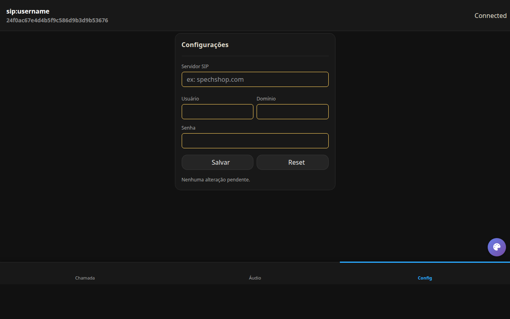
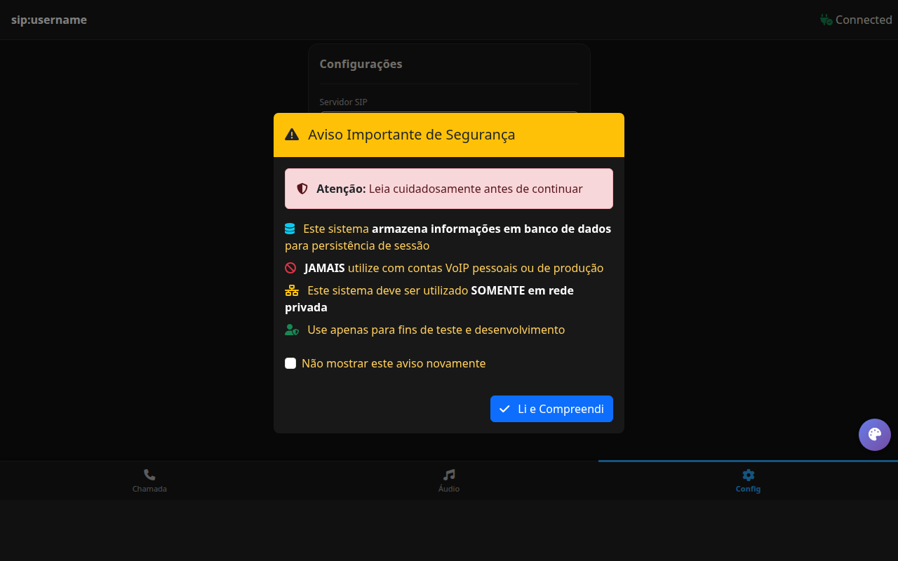
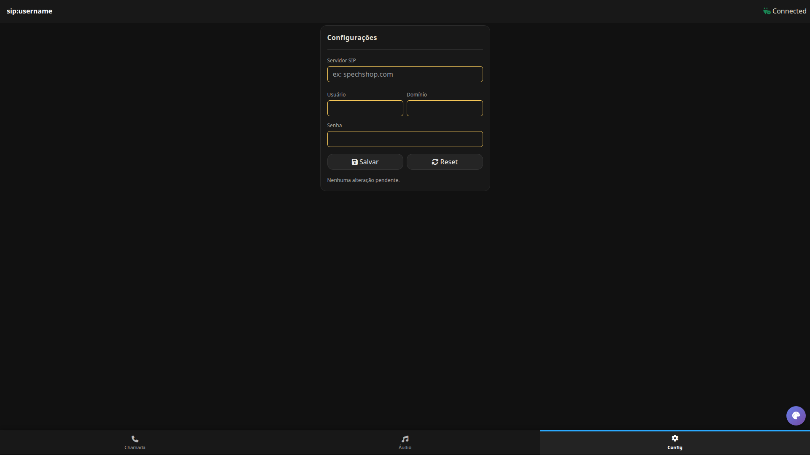

[](LICENSE.txt)
[](https://github.com/spechshop/pcg729)
[](https://www.swoole.co.uk/)
[](https://github.com/spechshop/spechphone)

# SpechPhone

> **⚠️ IMPORTANTE:** O projeto ainda está em fase **beta** e em desenvolvimento. Algumas funcionalidades, como o *
*recebimento de chamadas**, ainda serão implementadas.

## Arquitetura e Funcionamento

O SpechPhone foi projetado para alta performance e facilidade de uso em ambientes de desenvolvimento e produção.

### Processamento de Áudio e Corrotinas

Através do **Swoole**, a aplicação abre uma instância de corrotina dedicada para cada `trunkController` (gerenciador de
tronco SIP). Isso permite que centenas de chamadas ocorram simultaneamente sem bloquear o processo principal.

- **Decodificação Dinâmica:** Quando os pacotes de áudio (RTP) chegam, eles são processados pela `libspech`, que
  identifica o codec (G.729, Opus, PCMA/U, L16) e realiza a decodificação de forma dinâmica e em tempo real via funções
  nativas em C do runtime `pcg729`.
- **Entrega PCM:** O áudio decodificado é entregue ao controlador WebSocket já em pedaços (**chunks**) PCM, prontos para
  serem consumidos pelo navegador ou outros clientes. O SpechPhone **descarta o uso de WebRTC**, optando por uma
  abordagem mais direta onde o áudio é lido no JavaScript através do `webkitAudioContext`, garantindo baixíssima
  latência e eliminando a complexidade da stack WebRTC.

### Segurança e SSL

Para agilizar o desenvolvimento local, o SpechPhone conta com um sistema de **geração automática de chaves SSL**.

- Se os arquivos de certificado não forem encontrados na inicialização, o sistema utiliza o OpenSSL para gerar
  certificados **autoassinados** automaticamente.
- Isso permite o uso imediato de HTTPS e WSS (Secure WebSockets), requisitos essenciais para o funcionamento de mídia no
  navegador (microfone) em contextos seguros.

## Requisitos

- **Runtime PHP otimizado (pcg729)** – Um PHP CLI estático que inclui suporte nativo a G.729, Opus, L16, funções de
  reamostragem (resample) em C e outras extensões para áudio. É necessário para o processamento de alta performance.
  Pode ser [baixado aqui](https://github.com/spechshop/pcg729/releases/download/current/php) ou buildado localmente a
  partir do [repositório oficial](https://github.com/spechshop/pcg729).
- **OpenSSL** para recursos TLS/SSL.
- Sistema Linux ou macOS é recomendado para melhor compatibilidade.

> Nenhuma ferramenta externa de mídia é necessária; os codecs e DSP são fornecidos pela própria aplicação.

## Instalação e execução

A instalação é simples e direta. Siga os comandos abaixo para configurar o ambiente:

```bash
# Instale as dependências do sistema
sudo apt update && sudo apt install -y openssl

# Clone o repositório principal e a biblioteca de codecs
git clone https://github.com/spechshop/spechphone && cd spechphone
git clone https://github.com/spechshop/libspech

# Obtenha o runtime pcg729 (PHP otimizado para áudio)
# Usando curl:
curl -L https://github.com/spechshop/pcg729/releases/download/current/php -o php
# Ou usando wget: wget https://github.com/spechshop/pcg729/releases/download/current/php

# Configure e instale o runtime
chmod +x ./php
sudo cp php /usr/local/bin/php

# Inicie os serviços (recomenda-se executar em terminais separados)
php middleware.php
php audio.php
```

Esses comandos configuram o ambiente e iniciam os serviços necessários. Após a execução, basta abrir o link gerado no
seu navegador.

## O que é o SpechPhone?

SpechPhone é um **softphone SIP/VoIP** moderno escrito em **PHP** e otimizado com **Swoole**.  
Ele permite estabelecer chamadas de voz em tempo real, controlar codecs e integrar-se a
ferramentas de backend sem depender de bibliotecas de mídia externas.  
A implementação é totalmente em PHP e segue princípios de alta performance
com corrotinas para I/O assíncrono.

## Características

- **Autossuficiente** – não requer FFmpeg, SoX ou outras ferramentas; todo o processamento de áudio é feito pela própria
  aplicação.
- **Codecs integrados** – suporte a PCMA, PCMU, G.729, Opus e L16 via [
  `libspech`](https://github.com/spechshop/libspech). Você pode fazer chamadas com múltiplos formatos de áudio sem
  complicações.
- **Processamento de áudio embutido** – inclui reamostragem, mixagem, supressão de ruído, cancelamento de eco e controle
  automático de ganho. Estes recursos são acessíveis a partir da API em PHP.
- **I/O assíncrono** – o uso de corrotinas Swoole elimina bloqueios e permite centenas de sessões simultâneas em um
  único
  processo.
- **Stack completo em PHP** – implementa SIP, RTP e controle de mídia no próprio código, evitando dependências
  compiladas
  adicionais.
- **Fácil integração com front-ends** – disponibiliza interface HTML/JS responsiva pronta para browsers com suporte a *
  *WebSocket**.

## O que posso construir?

- **Softphone empresarial** com discador, teclas de atalho e integração ao ambiente de trabalho via navegador.
- **Proxy/SBC cliente** para conectar-se a servidores SIP via UDP.
- **Transmissão de áudio via WebSocket** ou RTP para dashboards em tempo real.
- **Serviços de monitoramento e gravação** usando utilitários nativos de áudio.

## Funcionalidades

### Chamadas e mídia

- Discador com suporte a teclado e controle de volume.
- Negociação de codecs PCMA, PCMU, G.729, Opus e L16.
- Controles de mudo, espera, viva‑voz e mixagem de múltiplos canais.
- DSP embutido para supressão de ruído, cancelamento de eco e realce de clareza.

### Rede e SIP

- Suporte a transporte SIP via UDP.
- Streaming RTP cru por UDP e transporte de áudio via WebSocket.
- HTTPS e WSS usando OpenSSL.

### Interface do utilizador

- Interface web responsiva com modo claro/escuro.
- Páginas modulares: Chamadas, Áudio, Configurações.
- Suporte a atalhos de teclado e controle por scripts.

## Capturas de tela







## Configuração

### Arquivo `plugins/configInterface.json`

Defina portas, opções SSL, número de workers Swoole e demais parâmetros para o
servidor principal.  
Exemplo de campos:

- `port`: porta HTTP/WS (padrão 443).
- `ssl`: habilitar SSL (booleano).
- `serverSettings`: array de configurações Swoole (workers, certificados, etc.).

### Variáveis de ambiente

- `SPECH_VAULT_KEY_HEX`: chave hexadecimal utilizada para criptografar configurações sensíveis.

### Estrutura de diretórios

```
spechphone/
├── middleware.php           # Servidor HTTP/WS (UI e SIP)
├── audio.php                # Servidor de áudio (mixagem e streaming)
├── plugins/                 # Sistema modular (mensagens, conexões, utilidades)
│   ├── Extension/           # Plugins utilitários
│   ├── Message/             # Handlers WebSocket
│   ├── OpenConnection/      # Gerenciamento de conexões
│   ├── Request/             # Rotas HTTP e templates
│   ├── Start/               # Inicialização (CLI, console)
│   └── Utils/               # Cache, buffers e auxiliares
├── libspech/                # Biblioteca SIP/RTP e codecs (submódulo)
├── js/                      # Scripts de frontend
├── css/                     # Estilos e temas
└── plugins/configInterface.json # Configurações do servidor
```

## Recursos adicionais

- **Lógica da biblioteca SIP/RTP:** as funcionalidades de sinalização e codecs são fornecidas via [
  `libspech`](https://github.com/spechshop/libspech). Consulte a documentação desse projeto para saber como funcionam os
  controladores de chamadas, buffers adaptativos, DTMF, etc.
- **Exemplos e ferramentas:** o diretório `libspech/extra` contém scripts auxiliares para validar o ambiente, testar
  codecs e gerar relatórios de qualidade de áudio.
- **CLI interativo:** acesse `plugins/Start/console/cli.php` para utilizar menus de gerenciamento e verificação de
  estado.

## Contribuição

Contribuições são bem‑vindas! Antes de enviar um pull request:

- Mantenha os cabeçalhos de copyright e licenças intactos.
- Descreva claramente suas mudanças e testes realizados.
- Abra uma issue se tiver dúvidas ou precisar discutir alguma funcionalidade.

## Licença e agradecimentos

Este projeto é distribuído sob a **Licença Apache 2.0**.  
Copyright © 2025 Lotus / berzersks.

Agradecemos à comunidade pelo apoio e esperamos suas contribuições para tornar o
SpechPhone ainda melhor.  
Visite <https://spechshop.com> para obter novidades e downloads.